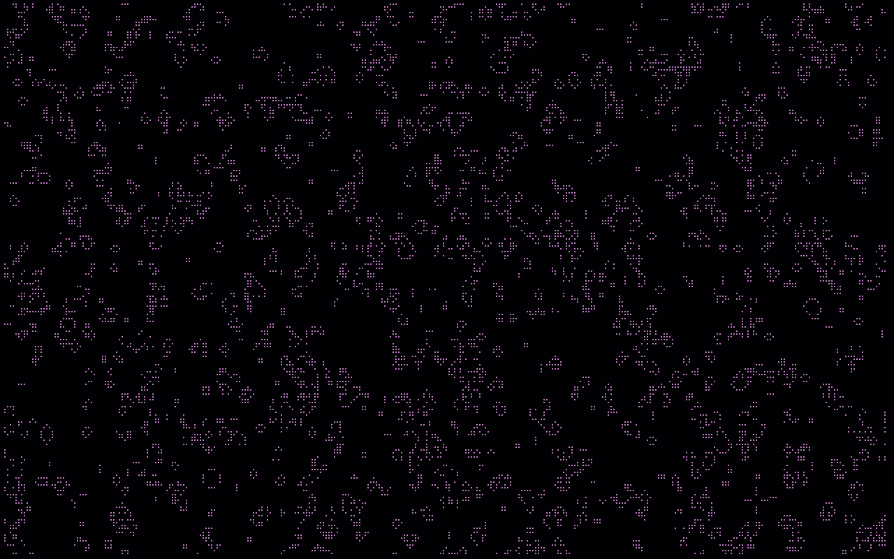

# Life

Terminal-saver script inspired by
[unimatrix](https://github.com/will8211/unimatrix)
(but neither as flexible nor as pretty).

Implements
[Conway's Game of Life](https://en.wikipedia.org/wiki/Conway%27s_Game_of_Life)
using python's curses and scipy's 2d convolution operation.

Configuration atop the script.


#### What have convolutions got to do with Life?

Convolutions are magical! The 2d convolution of the state array with the
simple filter `[[1 1 1] [1 0 1] [1 1 1]]` counts, for all cells, the
number of adjacent 'on' cells. This is exactly the kind of count we need!

The state update rule for Life is then succinctly implemented as follows:
```
c = convolve2d(a, [[1,1,1],[1,0,1],[1,1,1]], mode='same', boundary='wrap')
a = (a & (c == 2)) | (c == 3)
```



### TODO

* [x] Add multiple colours for newborn, stable, and recently dead cells.
* [x] Try fitting many more cells on the screen by using Braille glyphs.

---

Made with :purple_heart: by Matt
